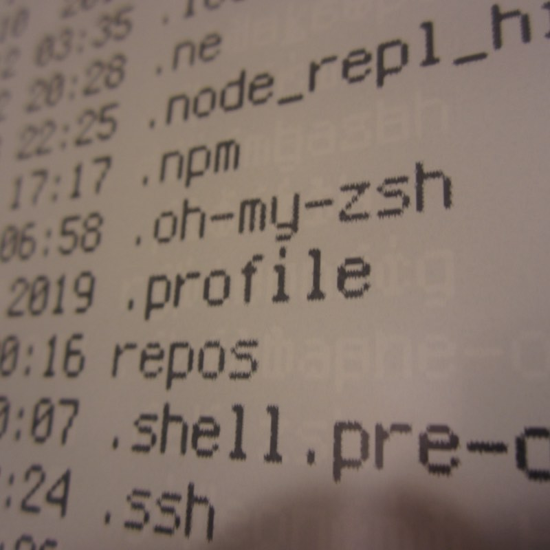
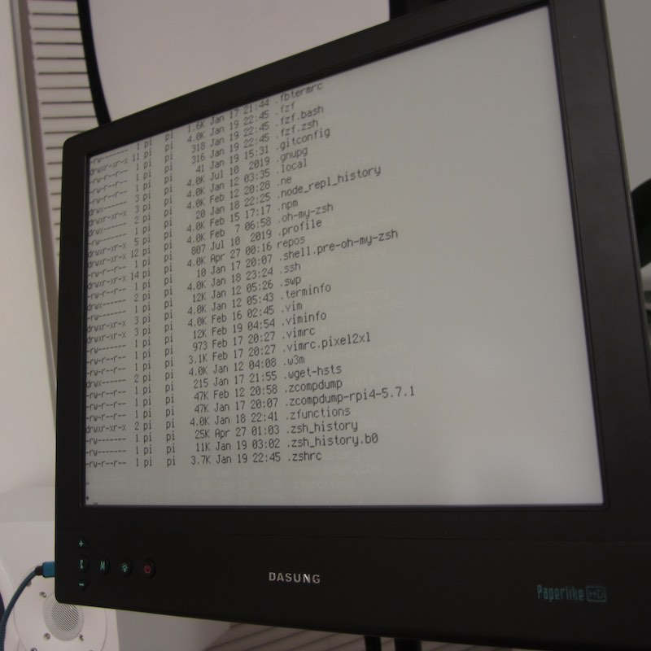

# Dotfiles PI4 Dasung



This repo is here to help you use your Dasung e-Ink monitor with your Raspberry PI.

Watch the YouTube video here: https://www.youtube.com/watch?v=2MOPYDlvA5Y&feature=youtu.be

## Steps

1. Copy the parts of the [`config.txt`](config.txt) you need to the `config.txt` file on your boot SD card.

2. When you start up your Raspberry PI, you should now see the login screen on your Dasung monitor.

    > Note: I am using this on [Raspberry PI4](https://www.raspberrypi.org/products/raspberry-pi-4-model-b/), with [Dasung Paperlike 3 HD-FT](https://www.amazon.com/Dasung-Paperlike-Front-Light-Touch-Monitor/dp/B07SKS6CS7). You may need to adjust the resolution if your monitor is not capable of the Paperlike 3 resolution.

3. Copy the [`bin`](bin/)  files from this repo to your home/bin folder `~/bin`.

    > The bin files contain a few functions to make life easier. More below in the Usage section.

4. Run the `bin/startup` command. This should adjust your color pallette to give you a white-on-black screen with a virtual resolution of 512 x 384.

## Config.txt

```bash
# uncomment if you get no picture on HDMI for a default "safe" mode
#hdmi_safe=1

# uncomment this if your display has a black border of unused pixels visible
# and your display can output without overscan
#disable_overscan=1

# uncomment the following to adjust overscan. Use positive numbers if console
# goes off screen, and negative if there is too much border
#overscan_left=16
#overscan_right=16
#overscan_top=16
#overscan_bottom=16

#framebuffer_width=1280
#framebuffer_height=720

# uncomment to force a specific HDMI mode (this will force VGA)
hdmi_group=2

# uncomment to increase signal to HDMI, if you have interference, blanking, or
# no display
config_hdmi_boost=1

# Dasung Paperlike HD-FT 
# https://www.indiegogo.com/projects/first-e-ink-monitor-with-front-light-touch
sdtv_aspect=3
hdmi_force_hotplug=1
hdmi_group=2
hdmi_mode=87
hdmi_cvt=2200 1650 60 6 0 0 0
hdmi_drive=1
max_usb_current=1
max_framebuffer_height=1650
hdmi_timings=2200 1 26 4 50 1650 1 8 2 6 0 0 0 60 0 135580000 
```

---

[Blog](https://f1lt3r.io) | [Instagram](https://www.instagram.com/f1lt3r/)

